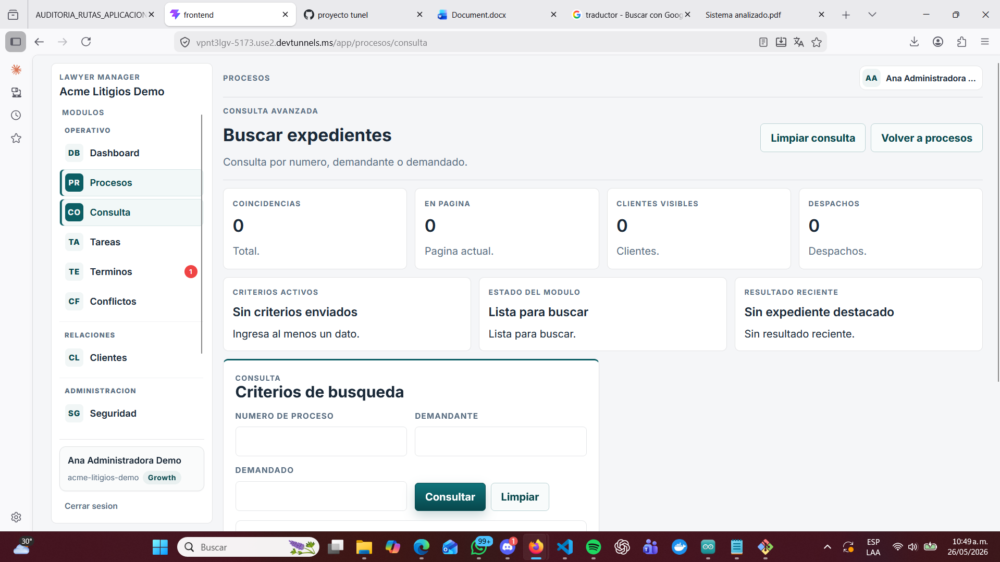
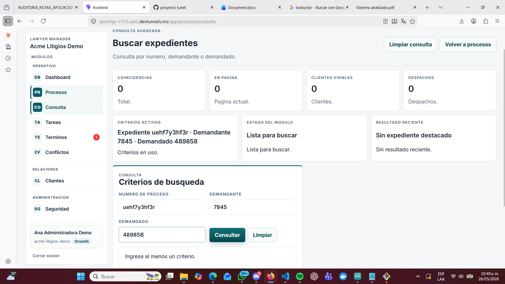

# Consulta — Auditoría de rutas y funcionalidades

**Aplicación:** Lawyer Manager — Acme Litigios Demo
**Fecha:** 26 de mayo de 2026
**Estado:**  Observaciones críticas

---

## Pantalla — app/procesos/consulta (Búsqueda avanzada)

**URL actual:** app/procesos/consulta
**URL propuesta:** app/cases/search

---

###  Error 1 — Nomenclatura incorrecta
El nombre de la ruta está en español. Debe cambiarse de app/procesos/consulta a app/cases/search.

---

###  Error 2 — Sin validaciones en los criterios de búsqueda
Los campos de número de proceso, demandante y demandado no tienen restricciones de tipo ni formato. Se pueden ingresar letras donde solo van números y viceversa sin ningún mensaje de error.

---

##  Funciona correctamente
- Botón Consultar → ejecuta la búsqueda
- Botón Limpiar → resetea el formulario
- Mensaje "Debes ingresar al menos un criterio de consulta" cuando no hay datos
- Botón Volver a procesos → redirige correctamente a app/procesos