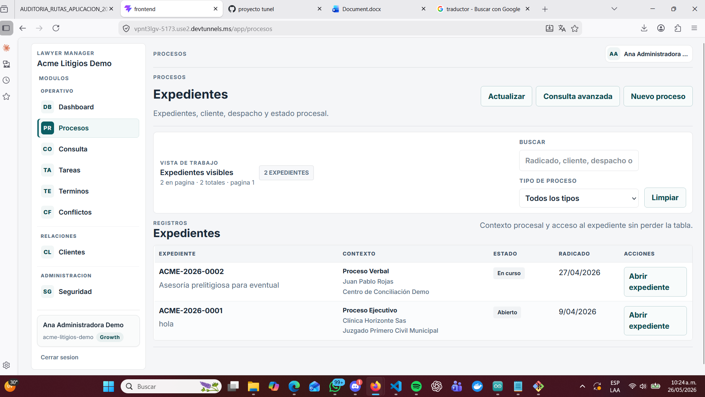
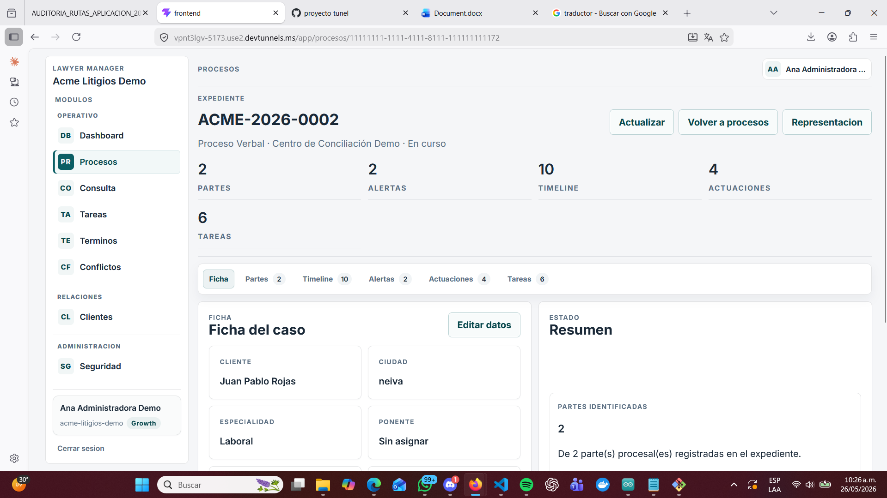
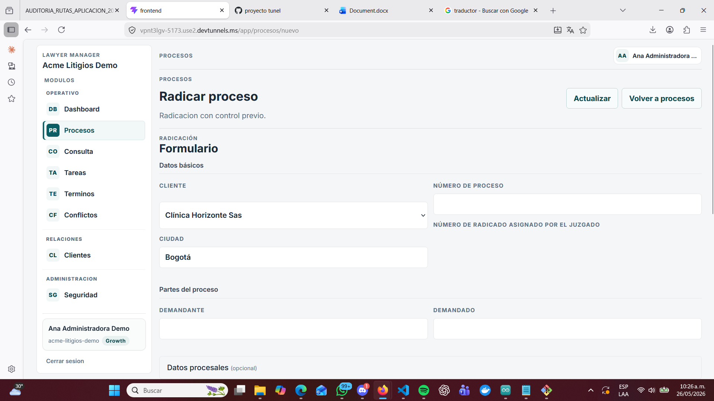
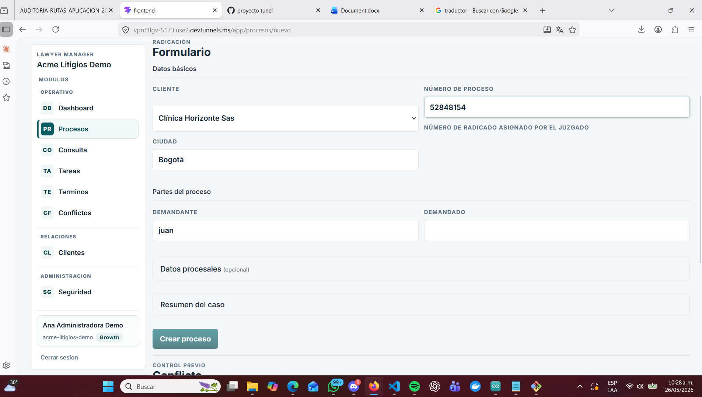
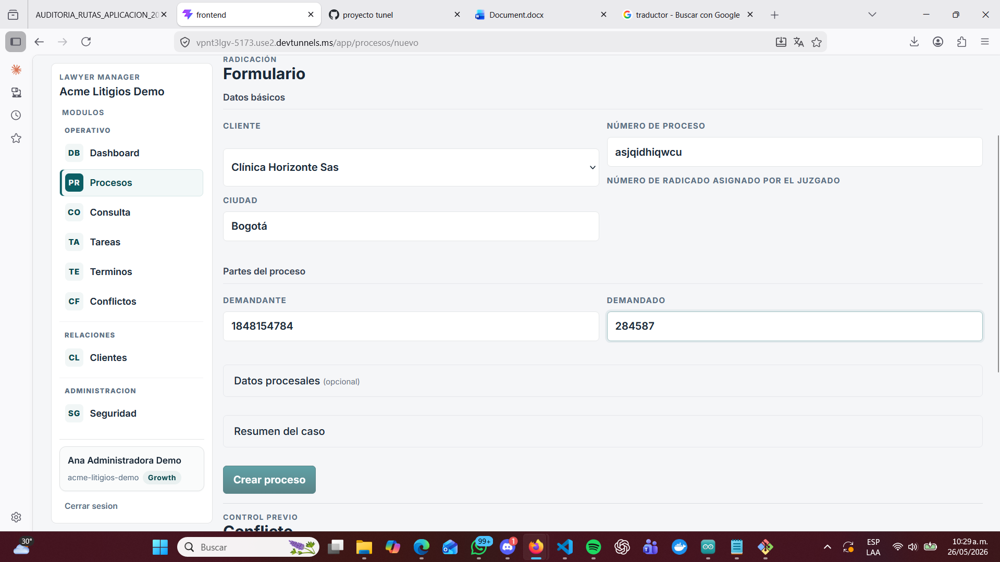
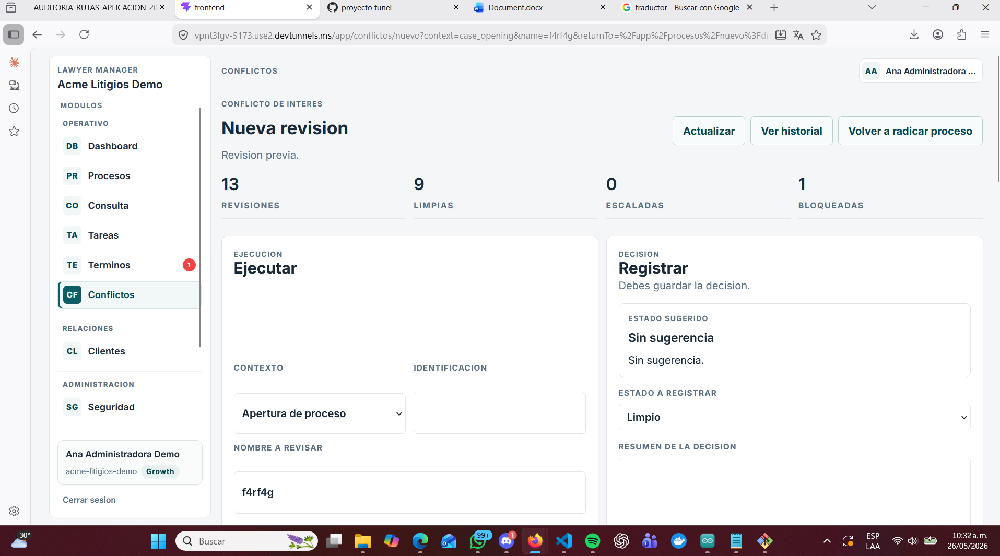
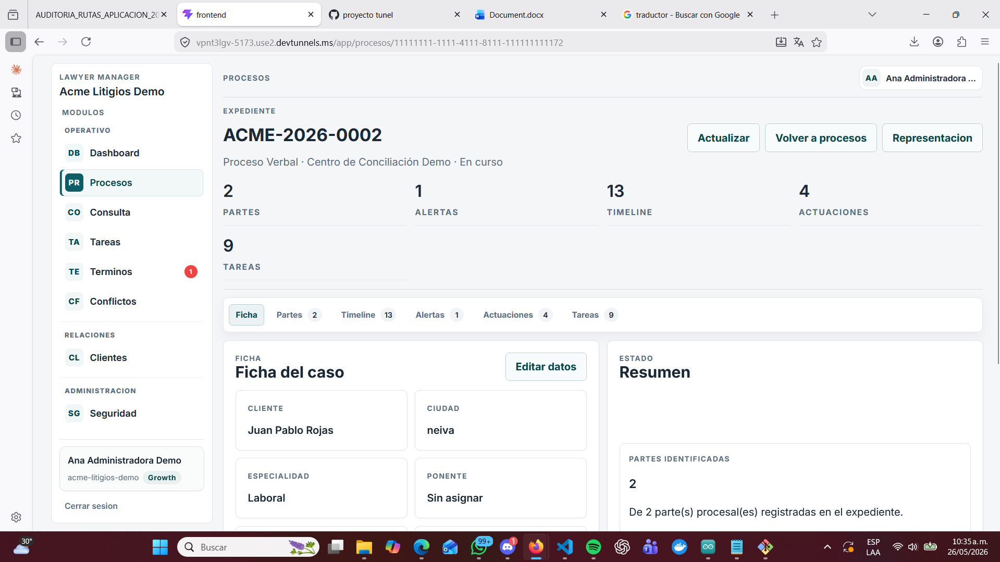
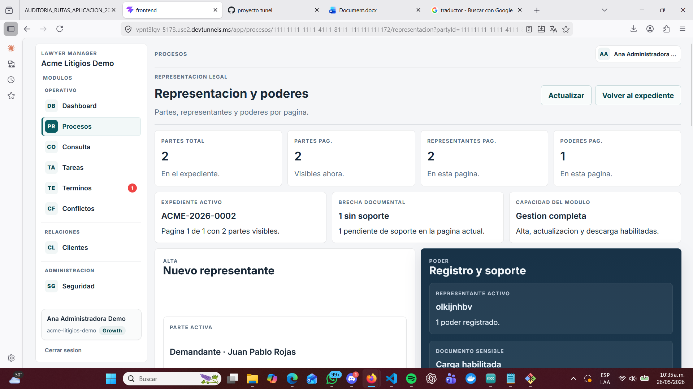
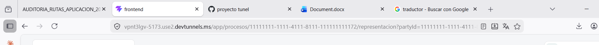
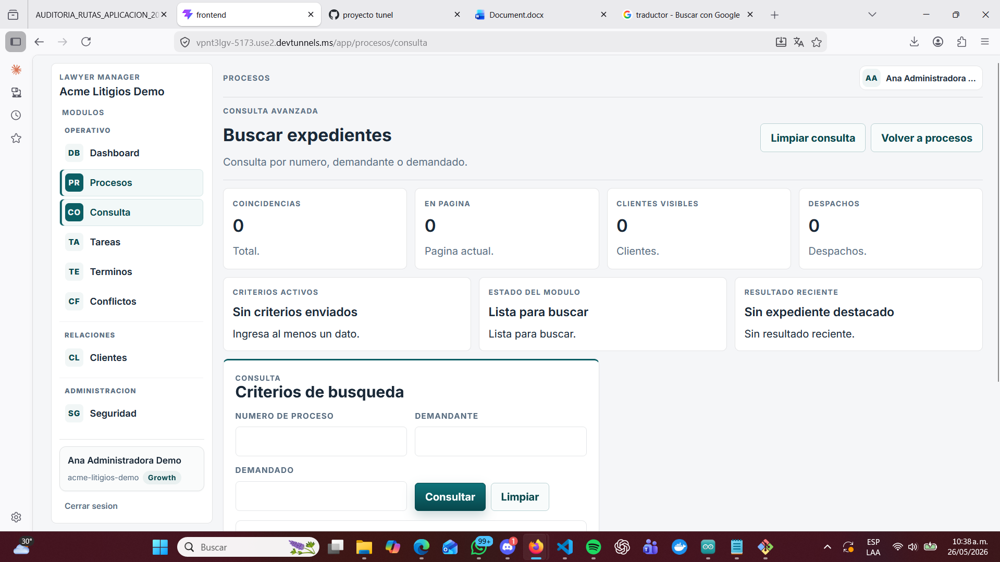

# Procesos — Auditoría de rutas y funcionalidades

**Aplicación:** Lawyer Manager — Acme Litigios Demo
**Fecha:** 26 de mayo de 2026
**Estado:**  Observaciones críticas

---

## Resumen ejecutivo

- 5 rutas con nombre en español (deben estar en inglés)
- Botón "Crear proceso" no funciona
- Botón "Actualizar" en representación no funciona
- Ningún formulario tiene validaciones
- Falta la operación eliminar (DELETE) en la lista de expedientes
- Una URL excesivamente larga de 531 caracteres

---

## Pantalla 1 — app/procesos (Lista de expedientes)

**URL actual:** app/procesos
**URL propuesta:** app/cases

###  Error 1 — Nomenclatura incorrecta
El nombre de la ruta está en español. Debe cambiarse de app/procesos a app/cases.

---

###  Error 2 — Operación DELETE faltante
No existe ningún botón para eliminar expedientes desde la lista. El único botón de acción disponible por expediente es "Abrir expediente". Se debe agregar una opción de eliminar en esta pantalla o dentro del detalle del expediente.

---

###  Funciona correctamente
- Botón Actualizar
- Botón Consulta avanzada → redirige a app/procesos/consulta
- Botón Nuevo proceso → redirige a app/procesos/nuevo
- Botón Abrir expediente → redirige al detalle del expediente
- Búsqueda por radicado, cliente o despacho
- Filtro por tipo de proceso
- Paginación

---

## Pantalla 2 — app/procesos/nuevo (Radicar proceso)

**URL actual:** app/procesos/nuevo
**URL propuesta:** app/cases/new

###  Error 1 — Nomenclatura incorrecta
El nombre de la ruta está en español. Debe cambiarse de app/procesos/nuevo a app/cases/new.

---

###  Error 2 — Botón "Crear proceso" no funciona
El formulario se muestra correctamente pero al intentar crear el proceso no ocurre ninguna acción.

---

###  Error 3 — Sin validaciones en el formulario
Los campos de demandante y demandado aceptan números. Los campos numéricos aceptan letras. No hay validación de campos obligatorios ni mensajes de error.

---

###  Advertencia — URL excesivamente larga de 531 caracteres
El enlace al formulario de conflicto genera una URL con más de 531 caracteres. Se recomienda migrar a POST con body JSON.

---

###  Funciona correctamente
- Botón Actualizar
- Botón Volver a procesos → redirige a app/procesos

---

## Pantalla 3 — app/procesos/{id} (Detalle del expediente)

**URL actual:** app/procesos/11111111-1111-4111-8111-111111111172
**URL propuesta:** app/cases/{id}

###  Error 1 — Nomenclatura incorrecta
El nombre de la ruta está en español. Debe cambiarse de app/procesos/{id} a app/cases/{id}.

---

###  Funciona correctamente
- Botón Actualizar
- Botón Volver a procesos → redirige a app/procesos
- Botón Representacion → redirige a app/procesos/{id}/representacion
- Tabs: Ficha, Partes, Timeline, Alertas, Actuaciones, Tareas
- Botón Editar datos

---

## Pantalla 4 — app/procesos/{id}/representacion (Representación y poderes)

**URL actual:** app/procesos/11111111-1111-4111-8111-111111111172/representacion
**URL propuesta:** app/cases/{id}/representation

###  Error 1 — Nomenclatura incorrecta
El nombre de la ruta está en español. Debe cambiarse de app/procesos/{id}/representacion a app/cases/{id}/representation.

---

###  Error 2 — Botón "Actualizar" no funciona
Al hacer clic no ocurre ninguna acción visible.

---

###  Advertencia — Query params en URL de representación
El botón Representacion genera una URL con partyId y representativeId como parámetros visibles. Se recomienda revisar si estos datos son sensibles.

---

###  Funciona correctamente
- Botón Volver al expediente → redirige a app/procesos/{id}

---

## Pantalla 5 — app/procesos/consulta (Búsqueda avanzada)

**URL actual:** app/procesos/consulta
**URL propuesta:** app/cases/search

###  Funciona correctamente
- Botón Consultar → ejecuta la búsqueda
- Botón Limpiar → resetea el formulario
- Mensaje "Debes ingresar al menos un criterio de consulta"
- Botón Volver a procesos → redirige a app/procesos

---

## Plan de corrección

### Prioridad 1 — CRÍTICO (Sprint actual)
1. Reparar botón "Crear proceso" en app/procesos/nuevo.
2. Reparar botón "Actualizar" en app/procesos/{id}/representacion.
3. Implementar validaciones en todos los formularios.
4. Implementar operación DELETE en app/procesos con soft-delete y tabla de auditoría.

### Prioridad 2 — IMPORTANTE (Próximo sprint)
5. Refactorizar nomenclatura de rutas a inglés con redirects 302 por 3 meses.
6. Refactorizar URL de 531 caracteres en app/conflictos/nuevo a POST con body JSON.