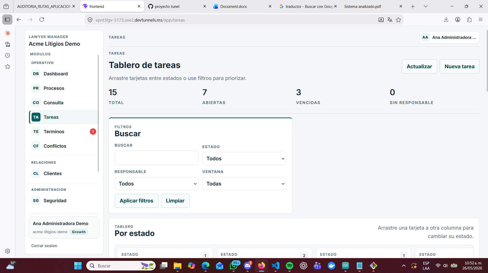
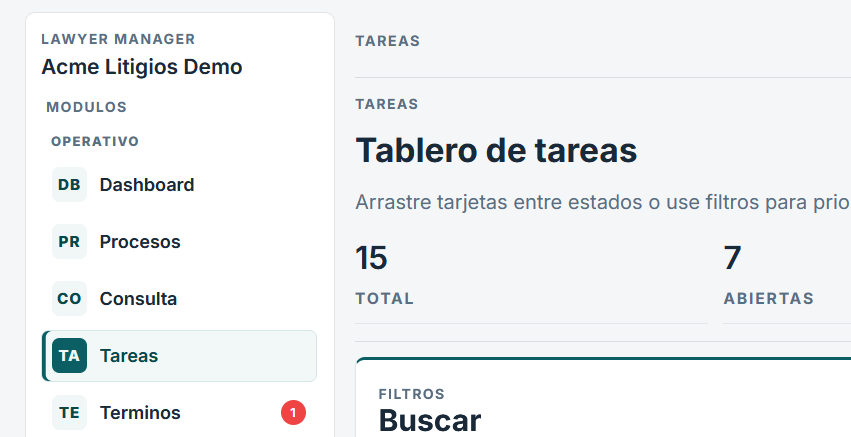
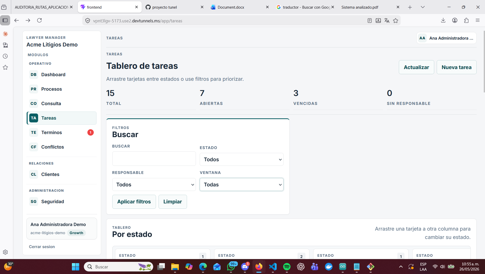
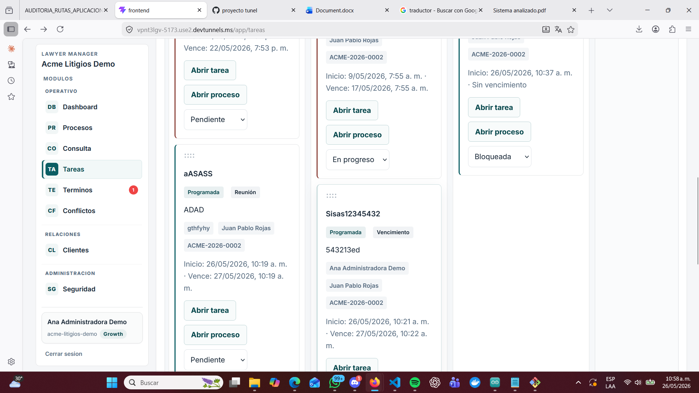
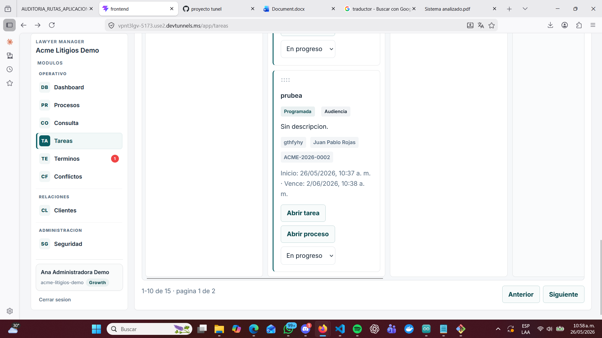
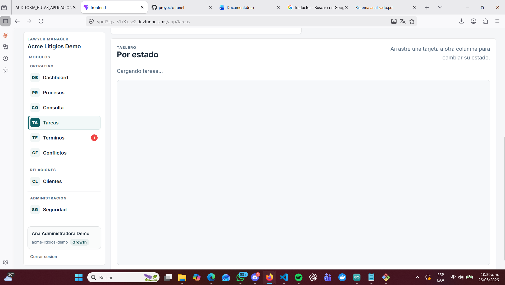

# Tareas — Auditoría de rutas y funcionalidades

**Aplicación:** Lawyer Manager — Acme Litigios Demo
**Fecha:** 26 de mayo de 2026
**Estado:**  Observaciones críticas

---

## Pantalla — app/tareas (Tablero de tareas)

**URL actual:** app/tareas
**URL propuesta:** app/tasks

---

###  Error 1 — Nomenclatura incorrecta
El nombre de la ruta está en español. Debe cambiarse de app/tareas a app/tasks.

---

###  Error 2 — Duplicidad de etiquetas
El título "TAREAS" aparece repetido en el encabezado y en el contenido principal de la pantalla, lo que genera redundancia visual innecesaria.

---

###  Error 3 — Mezcla de idiomas en la interfaz
La pantalla usa términos en español como "Tareas", "Buscar", "Aplicar filtros" y "Nueva tarea", cuando la estandarización solicitada requiere nomenclatura en inglés.

---

###  Error 4 — Pantalla mezcla consulta, creación y edición
La sección Tareas dentro del módulo Procesos no solo lista tareas sino que también despliega un formulario de creación. Esto afecta la claridad de la navegación porque mezcla tres funciones en una sola vista.

---

###  Advertencia 1 — Exceso de información en una sola vista
La pantalla ocupa mucho espacio vertical y obliga a hacer scroll para ver el tablero completo, lo que puede afectar la usabilidad.

---

###  Advertencia 2 — Columnas vacías en el tablero
El tablero kanban muestra columnas vacías cuando no hay tareas, lo que desperdicia espacio visual sin aportar información útil al usuario.

---

## Rutas observadas
| URL actual | URL propuesta |
|------------|---------------|
| app/tareas | app/tasks |
| app/tareas/nueva | app/tasks/new |

---

##  Funciona correctamente
- Resumen de indicadores: total, abiertas, vencidas, sin responsable
- Buscador de tareas por texto
- Filtros por estado, responsable y ventana temporal
- Botones aplicar filtros y limpiar filtros
- Tablero kanban con columnas por estado
- Botón Nueva tarea
- Botón Actualizar